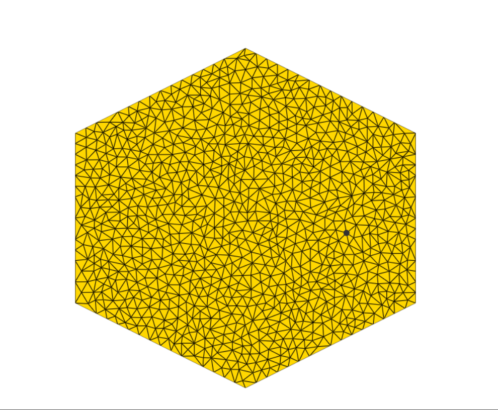
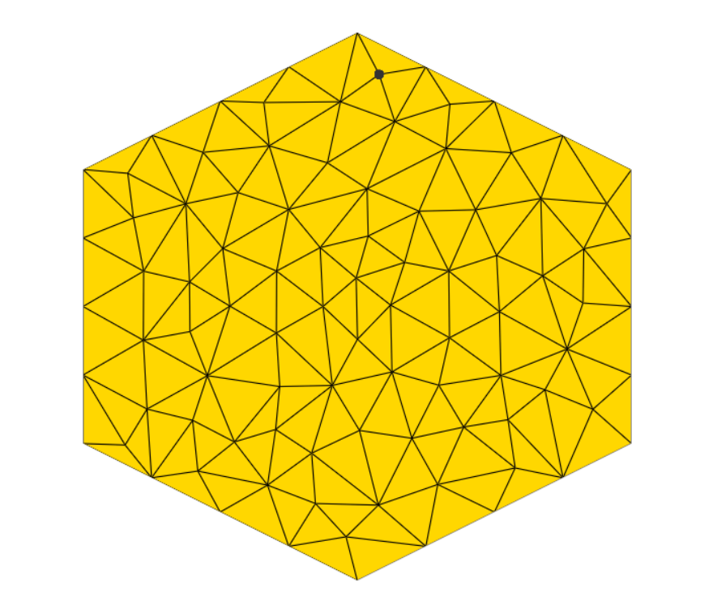
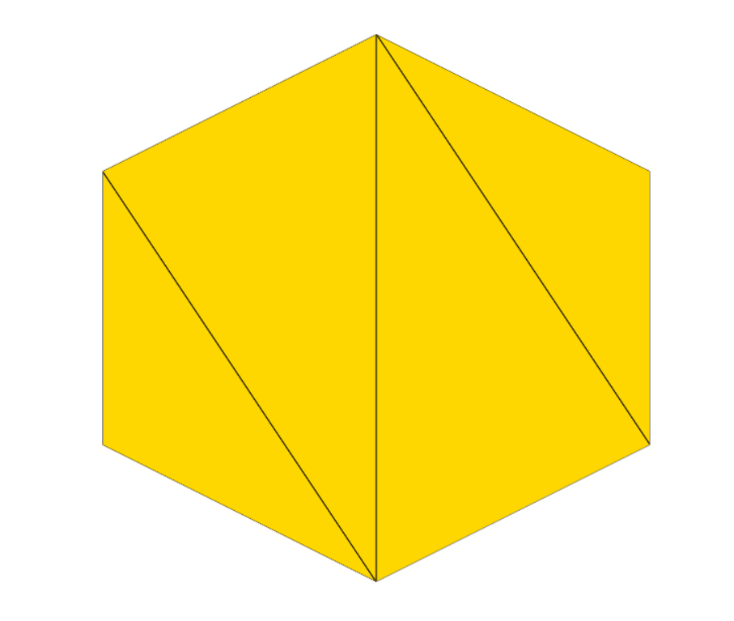
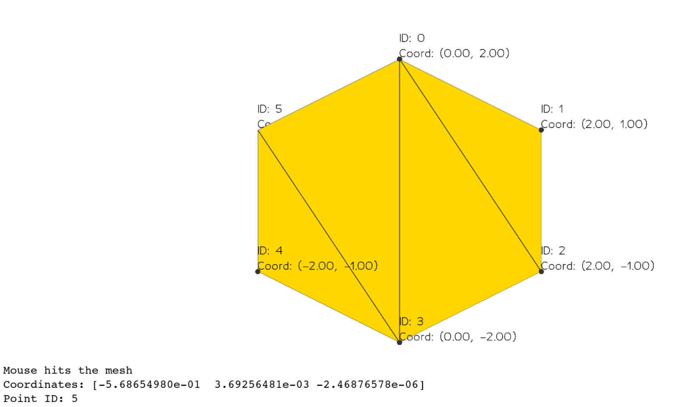

Task 1:
    1.1 Changed shape to hexagon.

    

    1.2.1 Triangulate to 100 triangles.

    

    1.2.2 Triangulate to no interior vertices

    

Task 2:
    2.1 Printing were moved to the Vedo window
    
    2.2 I made it so on left-mouse click it'll take the closest verex.
        Then the vertex can be dragged regardless the left-mouse-click released or did'nt. Finally, clicked on right-mouse-click the vertex again reposition itself on its new position.
        Attached clip: 
<video controls src="20240715-1343-35.6595075.mp4" title="Title"></video>