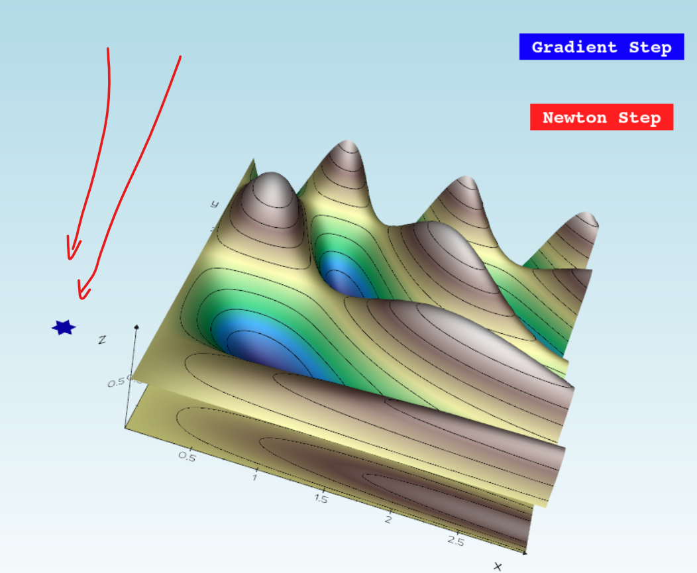
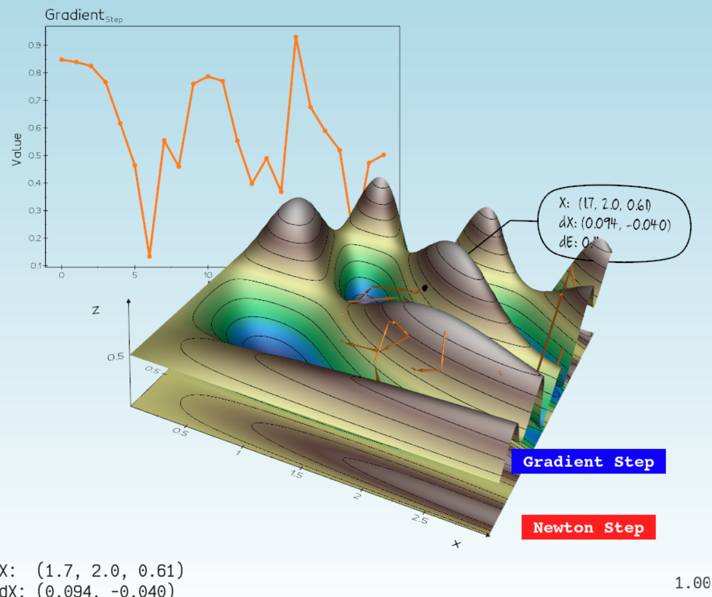
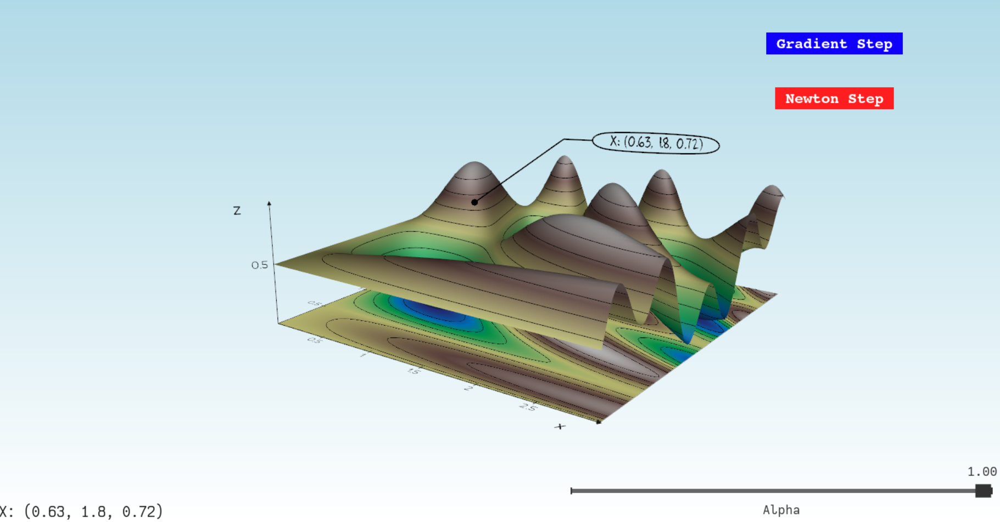
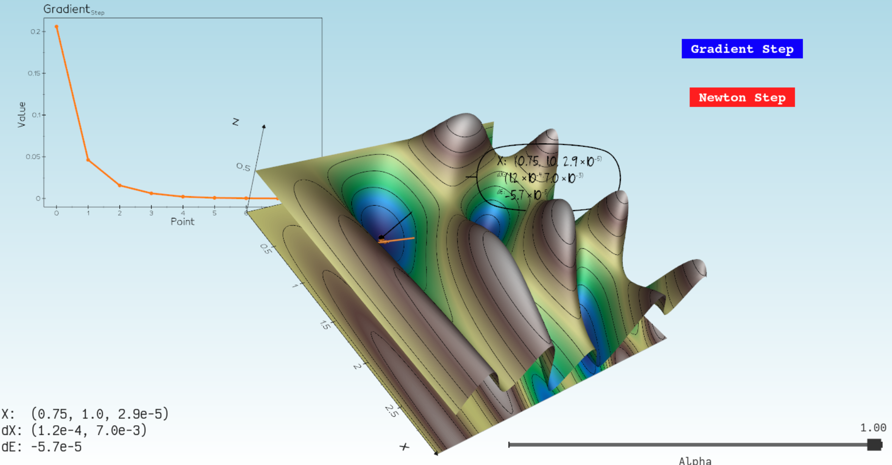
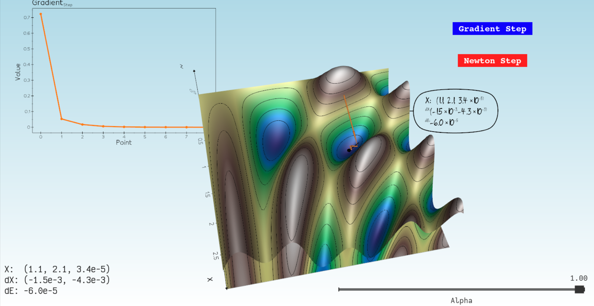
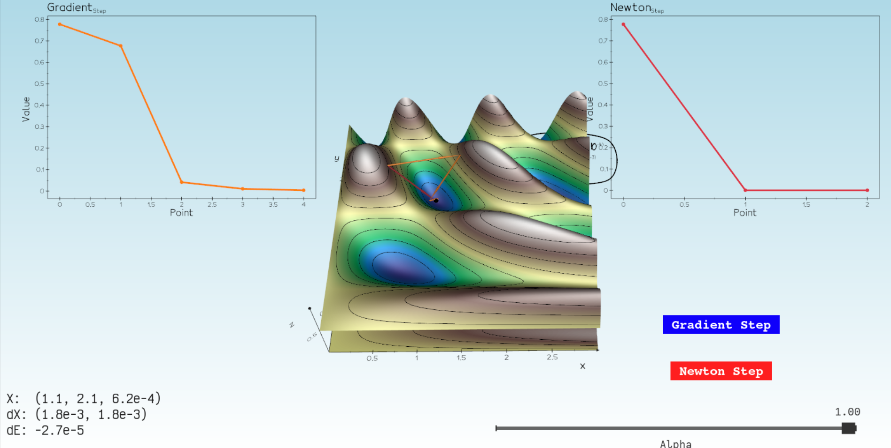
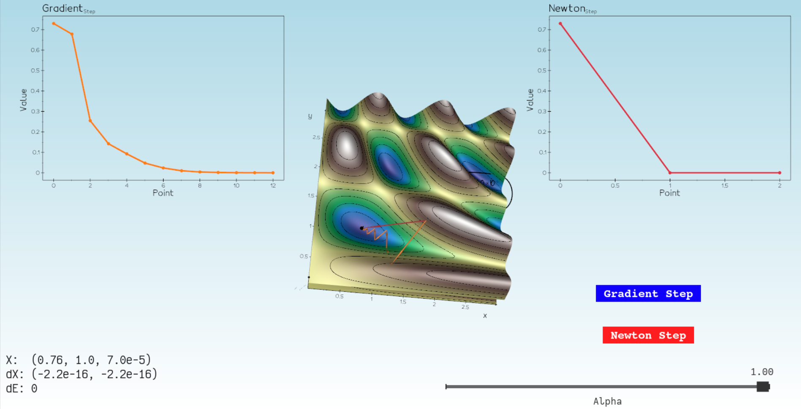
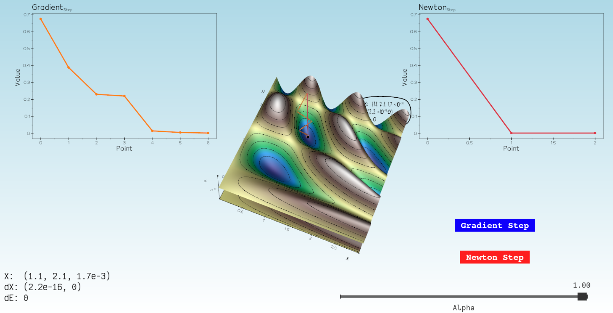
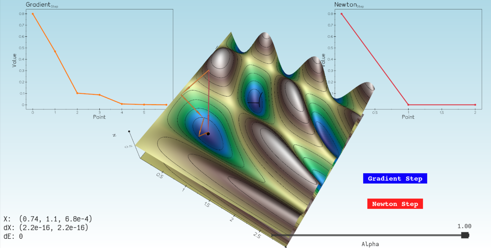

Name: Harel Avraham
I.D: 206233264

Task 1:
1. I added a Magen David on right-mouse click, attaching image.

2. As we can at the image:

Task 2:
In the following image we can see: 
- Gradient step button
- Newton Button
- Gradient step graph
- The path to the local minimum found by the gradient steps.
    .
    
    

Task 3:
1. At the following image we can see the added graph of newton step, and the added path of it (red one).

2. At the following image we can see that the Newton step is much faster than Gradient step:

